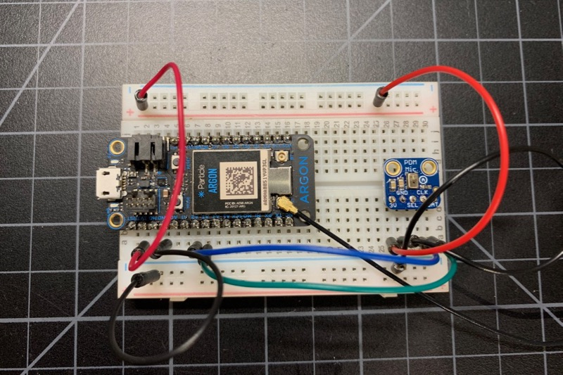
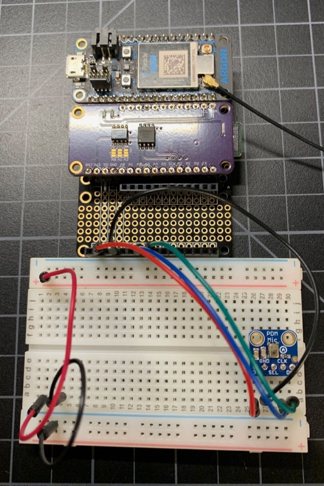

# PDM library (PDMGen3_RK)

*PDM (pulse-density modulation) library for Particle Gen 3 devices (Argon, Boron, Xenon)*

Digital MEMS microphones are commonly available in I2S and PDM interface. The I2S (sound) interface on the nRF52 unfortunately is not compatible with most I2S microphones. The PDM ([pulse-density modulation](https://en.wikipedia.org/wiki/Pulse-density_modulation)) interface, however, works quite well. 

PDM MEMS microphones are generally designed for voice use - not for high fidelity audio. The nRF52 samples it at around 16 kHz, with 12 to 16 bit samples. 

Adafruit has two breakout boards:

- [For use in a breadboard](https://www.adafruit.com/product/3492) 
- [With JST-SH connector](https://www.adafruit.com/product/4346)

Both are US$4.95 and there is [more information available at Adafruit](https://learn.adafruit.com/adafruit-pdm-microphone-breakout/). The boards include a [MP34DT01-M](https://cdn-learn.adafruit.com/assets/assets/000/049/977/original/MP34DT01-M.pdf) (PDF datasheet).

The pins needed for Adafruit PDM microphones are:

| Breakout Pin | Particle Pin | Description | Color |
| --- | --- | --- | --- |
| 3V | 3V3 | Power 3.3V | Red |
| GND | GND | Ground | Black |
| SEL | | Left/Right Select | No Connection |
| CLK | A2 | PDM Clock | Blue | 
| DAT | A3 | PDM Data | Green | 



- SEL - Left/Right select. If this pin is high, the output is on the falling edge of CLK considered the 'Right' channel. If this pin is low, the output is on the rising edge, a.k.a 'Left' channel. Has a pull-down to default to left so you can leave it unconnected.
- CLK - PDM clock into breakout board, 1 - 3 MHz square wave required.
- DAT - PDM data out of breakout board

Particle Gen 3 devices include a Nordic nRF52840 MCU. The nRF52 line includes a [hardware PDM decoder](https://infocenter.nordicsemi.com/index.jsp?topic=%2Fcom.nordic.infocenter.sdk5.v15.0.0%2Fhardware_driver_pdm.html), which is important because it's very processor intensive to decode PDM in software. The hardware decoder combined with DMA (direct memory access) makes it very efficient to read a PDM microphone.

- Full [browsable API documentation](https://rickkas7.github.io/PDMGen3_RK/)
- Repository: https://github.com/rickkas7/PDMGen3_RK
- License: MIT

## Examples

### Audio over TCP (8-bit)

This example sends the data as 16000 Hz, mono, 8-bit data over TCP to a node.js server. The intention is to use this with an Argon over a local Wi-Fi network to a computer on the same network.

- examples/1-audio-over-tcp

When you press the MODE button the transmission will begin and the blue D7 LED will turn on. The recording will go for 30 seconds, or until you press the MODE button again. 

You could easily modify the code to record longer, even indefinitely. It likely will not work  with a Boron over cellular as there is no compression of the data and the data rate is too high. It won't work with a Xenon over mesh because TCP is not supported on a mesh-only node, and also the data rate is too high.

To run the server:

```
cd server
npm install
npm start
```

When a client connects it creates a new file in the **out** directory. They're sequentially numbered and in wav format.

Make sure you update the device firmware to specify the IP address of your node.js server!

### Audio over TCP (16-bit)

This example is basically the same as the previous example but sends the data as 16000 Hz, mono, 16-bit instead of 8-bit. 

- examples/2-audio-over-tcp-16bit

The device firmware sends the data as raw PCM samples, so the server is also modified to generate the appropriate wav files.

### SdFat Wav 

When you press the MODE button this example records audio to a SD card. Pressing MODE stops recording. Each press creates a new, sequentially numbered file in the **audio** directory on the SD card.

- more-examples/1-sdfat

This example requires a lot of parts:

- Gen 3 Particle Device (Argon, Boron, or Xenon)
- SD card reader (connected by SPI)
- PDM microphone




## Version History

#### 0.0.1 (2019-12-13)

- Initial version


